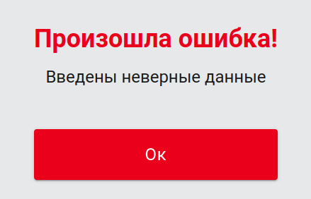
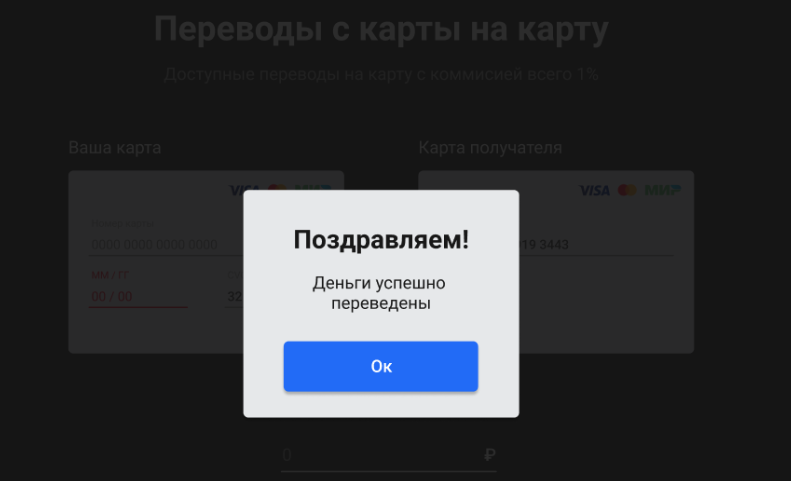

## Курсовой проект "Сервис перевода денег"

Необходимо разработать приложение — REST-сервис. Сервис должен предоставить интерфейс для перевода денег с одной карты на другую по заранее описанной спецификации ([протоколе](<Update MoneyTransferServiceSpecification.yaml>)).
Заранее подготовленное веб-приложение (FRONT) должно подключаться к разработанному сервису без доработок и использовать его функционал для перевода денег.

### Требования к приложению

- Сервис должен предоставлять REST-интерфейс для интеграции с FRONT.
- Сервис должен реализовывать все методы перевода с одной банковской карты на другую, описанные в  [протоколе](<Update MoneyTransferServiceSpecification.yaml>).
- Все изменения должны записываться в файл — лог переводов в произвольном формате с указанием:
даты; времени; карты, с которой было списание; карты зачисления; суммы; комиссии; результата операции, если был.

### Требования в реализации

- Приложение разработано с использованием Spring Boot.
- Использован сборщик пакетов gradle/maven.
- Для запуска используется Docker, Docker Compose .
- Код размещён на GitHub.
- Код покрыт юнит-тестами с использованием mockito.
- Добавлены интеграционные тесты с использованием testcontainers.

### Реализация

- Приложение разработано с использованием Spring Boot
- Использован сборщик пакетов gradle/maven
- Для запуска используется docker, docker-compose
- Код размещен на github
- Код покрыт unit тестами с использованием mockito
- Добавлены интеграционные тесты с использованием testcontainers

### Описание интеграции с FRONT

FRONT доступен по адресу https://github.com/serp-ya/card-transfer. Можно скачать репозиторий и запустить Node.js приложение локально (в описании репозитория FRONT добавлена информация, как запустить) или использовать уже развёрнутое демо-приложение по адресу https://serp-ya.github.io/card-transfer/ (тогда ваш API должен быть запущен по адресу http://localhost:5500/ ).

### Решение

Приложение представляет демо-версию простого сервиса перевода денежных средств с одной банковской карты на другую по описанной спецификации ([в протоколе](<Update MoneyTransferServiceSpecification.yaml>)). 

Логгирование работы сервиса выполняется в файл [clientLog.log](src/main/resources/static/clientLog.log)

#### Для запуска приложения с использованием Docker необходимо:
1. склонировать репозиторий,
2. в директории  выполнить команды (mvn clean),
3. затем по очереди (mvn package)  (-Dmaven.test.skip),
4. docker compose build.
5. После завершения монтирования образов, запуск приложения осуществляется командой docker compose up.
6. Проект будет доступен из браузера по ссылке http://localhost:5500/.

### Описание

Проект состоит из веб интерфейса и сервера для перевода денег с карты на карту.

Описание веб интерфейса можно посмотреть [по адресу](https://github.com/PoddubniySerg/MoneyTransferApp/blob/master/WebClient/card-transfer-master/README.md).

Сервер обрабатывает запросы от клиента. Проверяются валидации:
- Номер карты - обязательное, минимум 16 знаков
- ММ/ГГ - обязательное, минимум 5 знаков
- CVC - обязательное, минимум 3 знака
- Сумма перевода - обязательное, не может быть равное или меньше 0
- Номер карты отправителя и карты получателя не должны совпадать
- У карты получателя должен быть счет в валюте перевода
- На счете отправителя достаточно средств для выполения операции

#### Обработка запросов

Эндпоинты:
- /transfer - принимает объект и возвращает номер операции при успешном выполнении
- /confirmOperation - принимает объект с кодом верификации и возвращает номер операции при успешном выполнении
  
Если какой-либо из указанных валидаций не соблюдается, то выбрасывается исключение и клиенту возвращается ответ с ошибкой:

При успешном завершении, отображается соответствующее модальное окно и поля формы очищаются.

